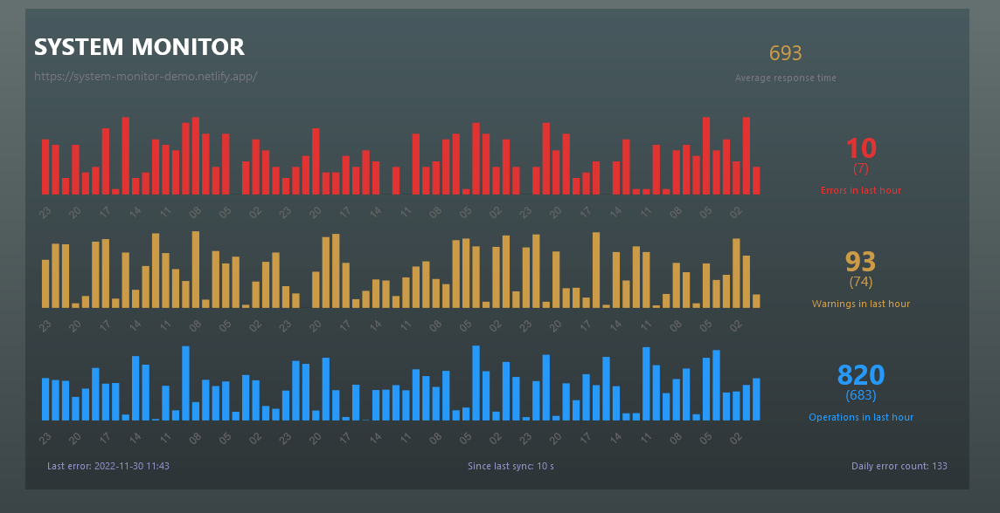

# System Monitor

Demo application for displaying data to support remote monitoring of IT systems performance. 

[system-monitor-demo.netlify.app](https://system-monitor-demo.netlify.app/)

[](https://app.netlify.com/sites/system-monitor-demo/deploys)



## Project setup
```
npm install
```

### Compiles and hot-reloads for development
```
npm run serve
```

### Compiles and minifies for production
```
npm run build
```

### Lints and fixes files
```
npm run lint
```

## Technologies
Project is created with:
* node.js: >=14.15.5 
* Vue.js: >=3.2.13

## Version
Latest: 0.1.0-dev


## Copyright and license
Code and documentation copyright 2011–2021 the [Tomasz Dopierala](https://github.com/tdopierala).
Code released under the [GNU General Public License v3.0](https://github.com/tdopierala/quizzer/blob/master/LICENSE).
